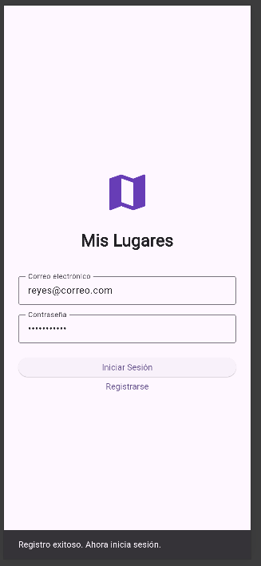
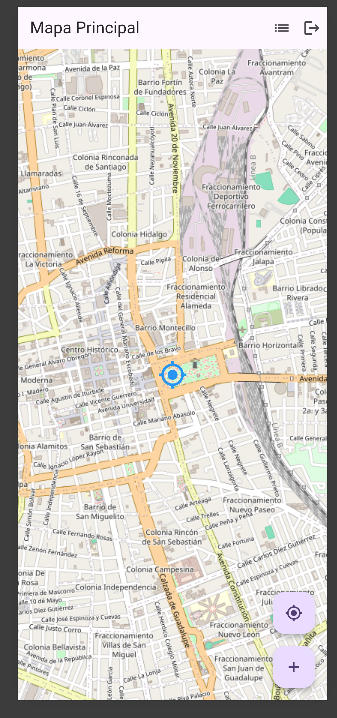
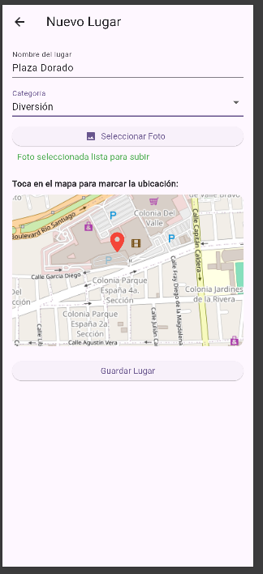
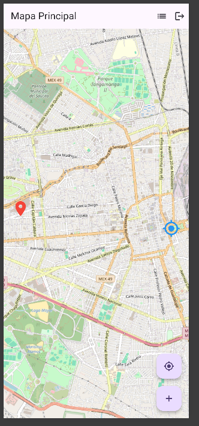
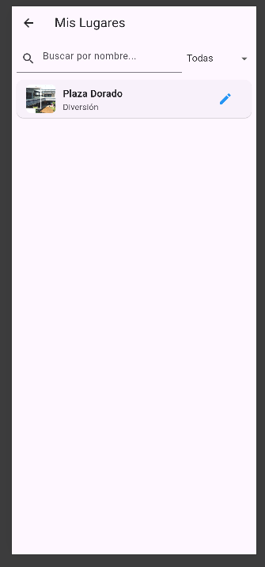
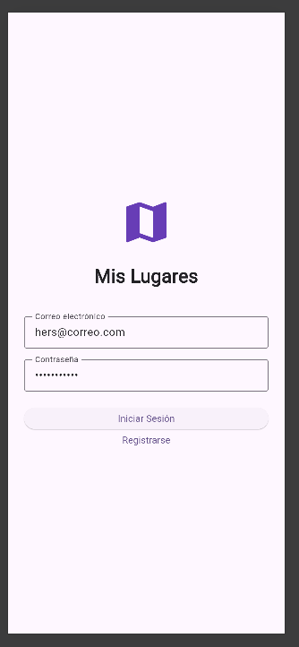
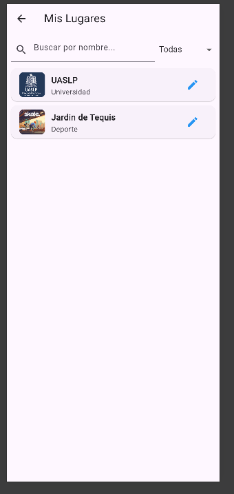
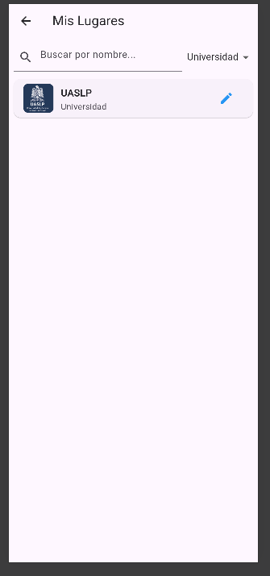
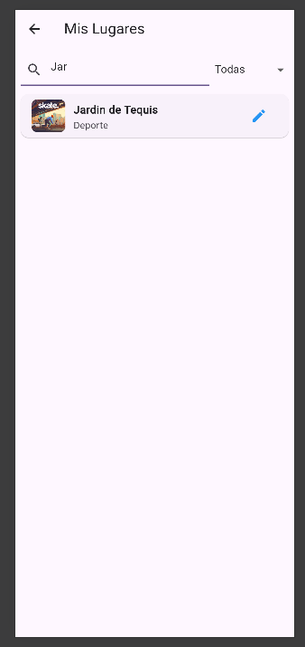
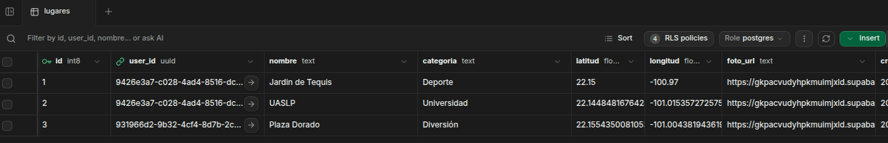

# Proyecto: Mis Lugares Favoritos

Instalar dependencias

```bash
flutter pub add supabase_flutter flutter_map latlong2 geolocator permission_handler image_picker
```

## Registrarse / Iniciar sesión
El usuario primero ingresa correo y contraseña para registrarse y ua vez registrado puede iniciar sessión





## Guardar un lugar



El lugar guardado se marca en un con un pin en el mapa



El usuario puede ver la lista de lugares guardados



## Iniciar sesión en otra cuenta



Ver lista de lugares guardados



El usuario puede aplicar filtros por categorias



Y cuenta con un buscador



## Supabase
Captura de tabla lugares


